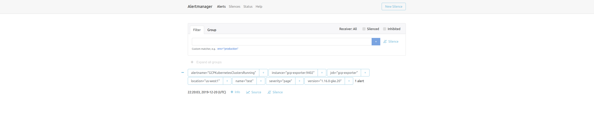

# Prometheus Exporter for [Google Cloud Platform (GCP)](https://cloud.google.com/)

[](https://github.com/DazWilkin/gcp-exporter/actions/workflows/build.yml)
[](https://pkg.go.dev/github.com/DazWilkin/gcp-exporter)
[](https://goreportcard.com/report/github.com/dazwilkin/gcp-exporter)

I want to be able to monitor my resource consumption across multiple cloud platforms ([GCP](https://cloud.google.com), [Digital Ocean](https://digitalocean.com) and [Linode](https://linode.com)). I was inspired by [@metalmatze](https://github.com/metalmatze)'s [DigitalOcean Exporter](https://github.com/metalmatze/digitalocean_exporter) and, with this exporter, have the three that I need:

+ [Google Cloud Platform Exporter](https://github.com/DazWilkin/gcp-exporter)
+ [Digital Ocean Exporter](https://github.com/metalmatze/digitalocean_exporter)
+ [Linode Exporter](https://github.com/DazWilkin/linode-exporter)

Result:


And:





## Installation

The application uses Google's [Application Default Credentials (ADCs)](https://cloud.google.com/docs/authentication/production#finding_credentials_automatically) to simplify authentication by finding credentials automatically.

On a machine running `gcloud` that's authenticated with your user (e.g. Gmail) account, you can run `gcloud auth application-default login` to establish your user account as ADCs. This ensures that the Exporter is able to operate as if it were you(r user account), enumerate GCP projects that you(r user account) has access to and resources within those projects.

If you run the Exporter remotely, you will need to create a service account for it to use. The Exporter will only be able to enumerate projects and project resources that this service account is able to access.

In the following examples, the Exporter's container is configured to use the ADCS stored in `${HOME}/.config/gcloud/appl...`

### Go

In this example, ADCs will be automatically detected without further configuration.

```bash
go get github.com/DazWilkin/gcp-exporter
go run github.com/DazWilkin/gcp-exporter
```

### Standalone

```bash
PORT=9402
CREDENTIALS="${HOME}/.config/gcloud/application_default_credentials.json"
REPO="ghcr.io/dazwilkin/gcp-exporter"
docker run \
--interactive --tty \
--publish=${PORT}:${PORT} \
--volume=${CREDENTIALS}:/secrets/client_secrets.json \
--env=GOOGLE_APPLICATION_CREDENTIALS=/secrets/client_secrets.json \
ghcr.io/dazwilkin/gcp-exporter:13e313adb19a5f3f7f22e98b757ed617396b0d71
```

### [Sigstore](https://www.sigstore.dev/)

`gcp-exporter` container images are being signed by Sigstore and may be verified:

```bash
cosign verify \
--key=./cosign.pub \
ghcr.io/dazwilkin/gcp-exporter:13e313adb19a5f3f7f22e98b757ed617396b0d71
```

> [!Note]
> `cosign.pub` may be downloaded [here](./cosign.pub)

To install `cosign`, e.g.:

```bash
go install github.com/sigstore/cosign/cmd/cosign@latest
```

### Docker Compose

```bash
docker-compose up
```

**NB** `docker-compose.yml` configuration for `gcp-exporter` services is:

```YAML
gcp-exporter:
  image: ghcr.io/dazwilkin/gcp-exporter:13e313adb19a5f3f7f22e98b757ed617396b0d71
  container_name: gcp-exporter
  environment:
  - GOOGLE_APPLICATION_CREDENTIALS=/secrets/client_secrets.json
  volumes:
  - /home/dazwilkin/.config/gcloud/application_default_credentials.json:/secrets/client_secrets.json
  expose:
  - "9402" # GCP Exporter port registered on Prometheus Wiki
  ports:
  - 9402:9402
```

The Docker Compose configuration includes:

+ [GCP Exporter](http://localhost:9402)
+ [Prometheus](http://localhost:9090)
+ [AlertManager](http://localhost:9093)
+ [cAdvisor](http://localhost:8085)

**NB** You will need to create an `alertmanager.yml` configuration file. This [example](https://www.robustperception.io/sending-email-with-the-alertmanager-via-gmail) shows you how to configure AlertManager to send alerts to Gmail

### Kubernetes

Assuming MicroK8s and Prometheus Operator

```bash
NAMESPACE="gcp-exporter"

kubectl create namespace ${NAMESPACE}

kubectl create secret generic gcp-exporter \
--from-file=client_secrets.json=/home/dazwilkin/.config/gcloud/application_default_credentials.json \
--namespace=${NAMESPACE}

kubectl apply \
--filename=./kubernetes.yaml \
--namespace=${NAMESPACE}

# NB This must be installed to 'monitoring' namespace
kubectl apply --filename=./kubernetes.rule.yaml  --namespace=monitoring
```

## Raspberry Pi

Learning about multi-arch builds to run on Raspberry Pi 4.

Unsure how to use `docker manifest` with GitHub Actions as this model has been suplanted by `docker buildx` (that I don't want to use).

Refactored `Dockerfile` to take a build argument `GOLANG_OPTIONS` (default=`CGO_ENABLED=0 GOOS=linux GOARCH=amd64`)

```bash
if [ "$(getconf LONG_BIT)" -eq 64 ]
then
  # 64-bit Raspian
  ARCH="GOARCH=arm64"
  TAG="arm64"
else
  # 32-bit Raspian
  ARCH="GOARCH=arm GOARM=7"
  TAG="arm32v7"
fi

docker build \
--build-arg=GOLANG_OPTIONS="CGO_ENABLED=0 GOOS=linux ${ARCH}" \
--build-arg=COMMIT=$(git rev-parse HEAD) \
--build-arg=VERSION=$(uname --kernel-release) \
--tag=ghcr.io/dazwilkin/gcp-exporter:${TAG} \
--file=./Dockerfile \
.
```

> [!Note]
> See [environment variables](https://golang.org/doc/install/source#environment)

### Podman

> [!Note]
> You will need to replace the service names (`alertmanager`, `gcp-exporter`, `gcp-status`, `cadvisor` and `node-exporter`) in `prometheus.yml` with `localhost`


> [!Note]
> Minimal set of containers pending cAdvisor support for Podman. See cAdvisor [Issue #2424](https://github.com/google/cadvisor/issues/2424) and [Pull #3021](https://github.com/google/cadvisor/pull/3021)
>
> ```bash
> sed \
> --in-place \
> --expression="s/\(alertmanager\|gcp-exporter\|gcp-status\|cadvisor\|node-exporter\):/localhost:/g" \
> prometheus.yml
> ```

```bash
POD="exporter"

# 8080: cAdvisor (Unavailabe)
# 9090: Prometheus
# 9093: AlertManager
# 9402: GCP Exporter
# 9100: Node Exporter
podman pod create \
--name=${POD} \
--publish=9090:9090 \
--publish=9093:9093 \
--publish=9402:9402 \
--publish=9100:9100

podman run \
--detach --tty --rm \
--pod=${POD} \
--name=prometheus \
--volume=${PWD}/prometheus.yml:/etc/prometheus/prometheus.yml \
--volume=${PWD}/rules.yml:/etc/alertmanager/rules.yml \
docker.io/prom/prometheus:v2.37.0 \
  --config.file=/etc/prometheus/prometheus.yml \
  --web.enable-lifecycle

podman run \
--detach --tty --rm \
--pod=${POD} \
--name=alertmanager \
--volume=${PWD}/alertmanager.yml:/etc/alertmanager/alertmanager/rules.yml \
docker.io/prom/alertmanager:v0.24.0

podman run \
--detach --tty --rm \
--pod=${POD} \
--name=gcp-exporter \
--env=GOOGLE_APPLICATION_CREDENTIALS=/secrets/key.json \
--volume=/home/userid/.config/gcloud/application_default_credentials.json:/secrets/key.json \
ghcr.io/dazwilkin/gcp-exporter:13e313adb19a5f3f7f22e98b757ed617396b0d71

podman run \
--detach --tty --rm \
--name=node-exporter \
--pod=${POD} \
--volume=/:/host:ro,rslave \
docker.io/prom/node-exporter:v1.1.2 \
  --path.rootfs=/host
```

## Develop

```bash
git clone git@github.com:DazWilkin/gcp-exporter.git && cd gcp-exporter
```

### Usage

```bash
gcp-exporter --help

Usage of gcp-exporter:
  --collector.artifact_registry.disable
      Disables the metrics collector for the Artifact Registry
  --collector.cloud_run.disable
      Disables the metrics collector for Cloud Run
  --collector.compute.disable
      Disables the metrics collector for Compute Engine
  --collector.endpoints.disable
      Disables the metrics collector for Cloud Endpoints
  --collector.eventarc.disable
      Disables the metrics collector for Cloud Eventarc
  --collector.functions.disable
      Disables the metrics collector for Cloud Functions
  --collector.gke.disable
      Disables the metrics collector for Google Kubernetes Engine (GKE)
  --collector.gke.extendedMetrics.enable
      Enable the metrics collector for Google Kubernetes Engine (GKE) to collect ControlPlane and NodePool metrics
  --collector.iam.disable
      Disables the metrics collector for Cloud IAM
  --collector.logging.disable
      Disables the metrics collector for Cloud Logging
  --collector.monitoring.disable
      Disables the metrics collector for Cloud Monitoring
  --collector.scheduler.disable
      Disables the metrics collector for Cloud Scheduler
  --collector.storage.disable
      Disables the metrics collector for Cloud Storage
  --endpoint string
      The endpoint of the HTTP server (default ":9402")
  --filter string
      Filter the results of the request
  --max_projects int
      Maximum number of projects to include (default 10)
  --path string
      The path on which Prometheus metrics will be served (default "/metrics")
```

Please file issues

## Metrics

|Name|Type|Description|
|----|----|-----------|
|`gcp_artifact_registry_formats`|Gauge|Number of Artifact Registry formats|
|`gcp_artifact_registry_locations`|Gauge|Number of Artifact Registry locations|
|`gcp_artifact_registry_registries`|Gauge|Number of Artifact Registry registries|
|`gcp_cloud_endpoints_services`|Gauge|Number of Cloud Endpoints services|
|`gcp_cloud_functions_functions`|Gauge|Number of Cloud Functions functions|
|`gcp_cloud_functions_locations`|Gauge|Number of Cloud Functions locations|
|`gcp_cloud_functions_runtimes`| Gauge| Number of Cloud Functions runtimes|
|`gcp_cloud_logging_logs`| Gauge| Number of Cloud Logging Logs|
|`gcp_cloud_monitoring_alert_policies`|Gauge|Number of Cloud Monitoring Alert Policies|
|`gcp_cloud_monitoring_uptime_checks`|Gauge|Number of Cloud Monitoring Uptime Checks|
|`gcp_cloud_run_jobs`|Gauge|Number of Cloud Run jobs|
|`gcp_cloud_run_services`|Gauge|Number of Cloud Run services|
|`gcp_cloud_scheduler_jobs`|Gauge|Number of Cloud Scheduler jobs|
|`gcp_compute_engine_forwardingrules`|Gauge|Number of forwardingrules|
|`gcp_compute_engine_instances`|Gauge|Number of instances|
|`gcp_exporter_build_info`|Counter|A metric with a constant '1' value labeled by OS version, Go version, and the Git commit of the exporter|
|`gcp_exporter_start_time`|Gauge|Exporter start time in Unix epoch seconds|
|`gcp_iam_service_account_keys`|Gauge|Number of Service Account Keys|
|`gcp_iam_service_accounts`|Gauge|Number of Service Accounts|
|`gcp_gke_info`|Gauge|Exports detailed information from the Cluster Control Plane, including `id`, `mode`, `endpoint`, `network`, `subnetwork`, `initial_cluster_version`, and `node_pools_count`. 1 if the Cluster is running, 0 otherwise. Enabled when the `--collector.gke.extendedMetrics.enable` flag is set|
|`gcp_gke_node_pools_info`|Gauge|Exports detailed information from the Cluster Node Pools, including `etag`, `cluster_id`, `autoscaling`, `disk_size_gb`, `disk_type`, `image_type`, `machine_type`, `locations`, `spot`, and `preemptible`. 1 if the Node Pool is running, 0 otherwise. Enabled when the `--collector.gke.extendedMetrics.enable` flag is set|
|`gcp_gke_nodes`|Gauge|Number of nodes currently in the Cluster|
|`gcp_gke_up`|Gauge|1 if the Cluster is running, 0 otherwise|
|`gcp_storage_buckets`|Gauge|Number of buckets|

## Prometheus API

```bash
curl \
--silent \
http://localhost:9090/api/v1/label/__name__/values \
| jq -r .data[]| awk '/^gcp/ {print}'
```

Yields:

```console
gcp_artifact_registry_formats
gcp_artifact_registry_locations
gcp_artifact_registry_registries
gcp_cloud_endpoints_services
gcp_cloud_functions_functions
gcp_cloud_functions_locations
gcp_cloud_functions_runtimes
gcp_cloud_logging_logs
gcp_cloud_run_services
gcp_compute_engine_forwardingrules
gcp_compute_engine_instances
gcp_exporter_build_info
gcp_exporter_start_time
gcp_gke_cluster_info
gcp_gke_cluster_node_pools_info
gcp_gke_cluster_nodes
gcp_gke_cluster_up
gcp_projects_count
gcp_storage_buckets
```

## Port

Registered `9402` with Prometheus Exporters' [default port allocations](https://github.com/prometheus/prometheus/wiki/Default-port-allocations#exporters-starting-at-9100)

## References

Using Google's (now legacy) API Client Libraries. The current Cloud Client Libraries do not provide coverage for all the relevant resources.

+ Google [Compute Engine API](https://cloud.google.com/compute/docs/reference/rest/)
+ Google [Resource Manager API](https://cloud.google.com/resource-manager/reference/rest/) && [GoDoc](https://godoc.org/google.golang.org/api/cloudresourcemanager/v1)
+ Google [Kubernetes Engine (Container) API](https://cloud.google.com/kubernetes-engine/docs/reference/rest/) && [GoDoc](https://godoc.org/google.golang.org/api/container/v1)

## Similar Exporters

+ [Prometheus Exporter for Azure](https://github.com/DazWilkin/azure-exporter)
+ [Prometheus Exporter for crt.sh](https://github.com/DazWilkin/crtsh-exporter)
+ [Prometheus Exporter for Fly.io](https://github.com/DazWilkin/fly-exporter)
+ [Prometheus Exporter for GoatCounter](https://github.com/DazWilkin/goatcounter-exporter)
+ [Prometheus Exporter for Google Cloud](https://github.com/DazWilkin/gcp-exporter)
+ [Prometheus Exporter for Koyeb](https://github.com/DazWilkin/koyeb-exporter)
+ [Prometheus Exporter for Linode](https://github.com/DazWilkin/linode-exporter)
+ [Prometheus Exporter for PorkBun](https://github.com/DazWilkin/porkbun-exporter)
+ [Prometheus Exporter for updown.io](https://github.com/DazWilkin/updown-exporter)
+ [Prometheus Exporter for Vultr](https://github.com/DazWilkin/vultr-exporter)

<hr/>
<br/>
<a href="https://www.buymeacoffee.com/dazwilkin" target="_blank"></a>
