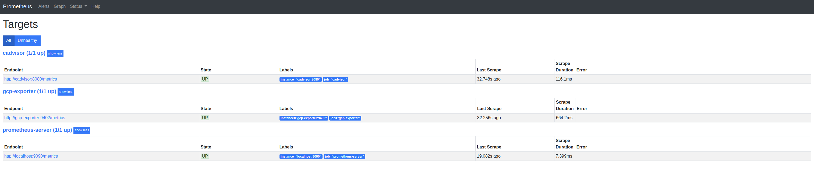
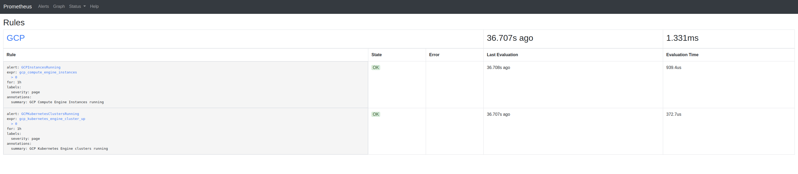
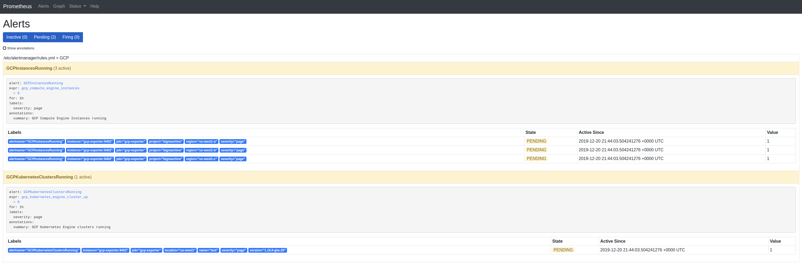
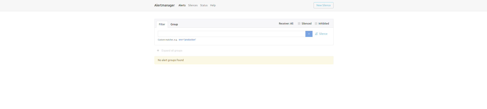

# Prometheus Exporter for [Google Cloud Platform (GCP)](https://cloud.google.com/) resources

I want to be able to monitor my resource consumption across multiple cloud platforms (GCP, Digital Ocean and Linode). I was inspired by [@metalmatze](https://github.com/metalmatze)'s [DigitalOcean Exporter](https://github.com/metalmatze/digitalocean_exporter) and, with this exporter, have the three that I need:

+ [Google Cloud Platform Exporter](https://github.com/DazWilkin/gcp-exporter)
+ [Digital Ocean Exporter](https://github.com/metalmatze/digitalocean_exporter)
+ [Linode Exporter](https://github.com/DazWilkin/linode-exporter)

Result:





And:



## Installation

The application uses Google's [Application Default Credentials (ADCs)](https://cloud.google.com/docs/authentication/production#finding_credentials_automatically) to simplify authentication by finding credentials automatically.

On a machine running `gcloud` that's authenticate with your user (e.g. Gmail) account, you can run `gcloud auth application-default` to establish your user account as ADCs. This ensures that the Exporter is able to operate as if it were you(r user account), enumerate GCP projects that you(r user account) has access to and resources within those projects. If you run the Exporter remotely, you will need to create a service account for it to use. The Exporter will only be able to enumerate projects and project resources that this service account is able to access.

In the following examples, the Exporter's container is configured to use the ADCS stored in `${HOME}/.config/gcloud/appl...`

### Go

In this example, ADCs will be automatically detected without further configuration.

```bash
go get github.com/DazWilkin/gcp-exporter
go run github.com/DazWilkin/gcp-exporter
```

### Standalone
```bash
PORT=9402
CREDENTIALS="${HOME}/.config/gcloud/application_default_credentials.json"
REPO="dazwilkin/gcp-exporter"
docker run \
--interactive --tty \
--publish=${PORT}:${PORT}
--volume=${CREDENTIALS}:/secrets/client_secrets.json \
--env=GOOGLE_APPLICATION_CREDENTIALS=/secrets/client_secrets.json
dazwilkin/gcp-exporter:915d6400c96d89ab28d8cd41ea3ddbb3df2e9d7e
```
### Docker Compose
```bash
docker-compose up
```
**NB** `docker-compose.yml` configuration for `gcp-exporter` services is:
```YAML
gcp-exporter:
  image: dazwilkin/gcp-exporter:915d6400c96d89ab28d8cd41ea3ddbb3df2e9d7e
  container_name: gcp-exporter
  environment:
  - GOOGLE_APPLICATION_CREDENTIALS=/secrets/client_secrets.json
  volumes:
  - /home/dazwilkin/.config/gcloud/application_default_credentials.json:/secrets/client_secrets.json
  expose:
  - "9402" # GCP Exporter port registered on Prometheus Wiki
  ports:
  - 9402:9402
```

The Docker Compose configuration includes:

+ [GCP Exporter](http://localhost:9402)
+ [Prometheus](http://localhost:9090)
+ [AlertManager](http://localhost:9093)
+ [cAdvisor](http://localhost:8085)

**NB** You will need to create an `alertmanager.yml` configuration file. This [example](https://www.robustperception.io/sending-email-with-the-alertmanager-via-gmail) shows you how to configure AlertManager to send alerts to Gmail

## Develop

```bash
git clone git@github.com:DazWilkin/gcp-exporter.git && cd gcp-exporter
```

Please file issues

## Metrics

| Name                                       | Type    | Description
| ----                                       | ------- | -----------
| `gcp_exporter_buildinfo`                   | Counter ||
| `gcp_exporter_startime`                    | Gauge   ||
| `gcp_compute_engine_instances`             | Gauge   ||
| `gcp_kubernetes_engine_cluster_up`         | Gauge   ||
| `gcp_kubernetes_engine_cluster_nodes`      | Gauge   ||

## Port

Registered `9402` with Prometheus Exporters' [default port allocations](https://github.com/prometheus/prometheus/wiki/Default-port-allocations#exporters-starting-at-9100)

## References

Using Google's (now legacy) API Client Libraries. The current Cloud Client Libraries do not provide coverage for all the relevant resources.

+ Google [Compute Engine API](https://cloud.google.com/compute/docs/reference/rest/)
+ Google [Resource Manager API](https://cloud.google.com/resource-manager/reference/rest/) && [GoDoc](https://godoc.org/google.golang.org/api/cloudresourcemanager/v1)
+ Google [Kubernetes Engine (Container) API](https://cloud.google.com/kubernetes-engine/docs/reference/rest/) && [GoDoc](https://godoc.org/google.golang.org/api/container/v1)